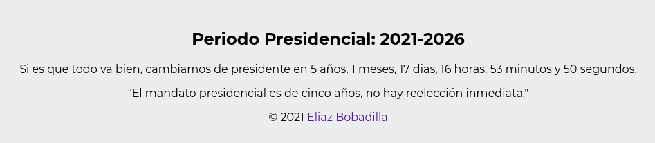

# Presidentes del Perú

Cuenta regresiva para el nuevo Presidente del Perú y cuanto
ha pasado desde que acabo el mandato de cada Presidente.

Puedes visitar el sitio en:
https://ultirequiem.github.io/PeruPresidents

## Desarrollo

Puedes clonar el Repositorio y trabajar con normalidad, todo es vanila JavaScript.

## Licencia

[MIT LICENSE](./LICENSE)
